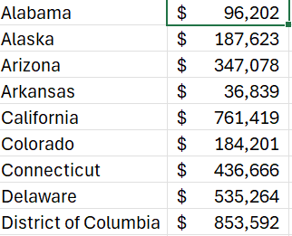

# Median Income and Notable Highlights by State  

# Introduction
The above dashboard provides a visual and data_driven way to explore median household income and notable highlights across U.S. states. By selecting a state from the dropdown, users can instantly see a color-coded map showing income distribution nationwide, along with the state’s region, median income, a famous person from that state, and a major tourist attraction with an accompanying image. This dashboard combines economic data with cultural insights to provide a more complete understanding of each state’s unique profile, making it both informative and visually appealing for presentations, reports, or simply exploring interesting patterns in U.S. demographics.
### Excel File
[zip_code_demographics](zip_code_demographics.xlsx)

### Skills in Excel I Used
* Data validation
* Formulars and functions
* Charts
### Dataset
The original dataset contains detailed demographic and economic information for over 30,000 U.S. ZIP codes, including location attributes (city, state, county, latitude, longitude), population figures, income metrics (adjusted gross income, total income amount, number of tax returns), and business indicators like the number of businesses per ZIP code. The dataset was downloaded from Kaggle.
The dataset used for this project was a table (called MyTable) that was a copy of the original dataset, with some of the columns deleted. Below are the columns used in this project:
* state_name
* total_income_amount
* most_famous_person
* top_tourist_attraction
* Region
# Building the Dashboard
## Data validation
Enhanced data validation was used to allow users to interact with the dashboard and provide economic and georgraphic insights for all the unique states in the dataset.

## Formulars and functions
### Median Income by State
```excel
MEDIAN(IF(A2=MyTable[state_name],
        MyTable[total_income_amount]))
```
Below is what each portion of the above formula:

`A2=MyTable[state_name]`
* Compares the state name in cell A2 to each value in the `state_name` column of `MyTable`. `A2` updates as we auto fill the rest of the rows.
* Produces an array of TRUE/FALSE indicating which rows match the state.

`IF(A2=MyTable[state_name], MyTable[total_income_amount])`
* Returns an array where each value is the  corresponding `total_income_amount` if the state matches A2.

`MEDIAN(....)`
* Computes the median of all matching `total_income_amount` values, ignoring FALSEs.

* Effectively gives the median total income amount for all ZIP codes within the state named in A2.

### Sample of Median Income Table by State

### XLOOKUP 
The XLOOKUP function was used to display, median income, region, famous_person, and tourist_attraction for each state selected in the data validation cell. Below is one example of how this function was used:
`=XLOOKUP(state,MyTable[state_name],MyTable[top_tourist_attraction])`

`state`

* The state name to look up (e.g., "Minnesota"). This is the lookup value.

`MyTable[state_name]`

* The lookup array—the column in my Excel table containing state names.

* XLOOKUP searches this column for the value specified in state.

`MyTable[top_tourist_attraction]`

* the column with the top tourist attraction corresponding to each state. This is the return array.

* XLOOKUP returns the attraction matching the found state.
## Charts

**Chart Type**: Filled Map Chart (State-by-State Median Income)

**Data Source**: Calculated using the dataset, aggregating `total_income_amount` for each ZIP code within each state.

**Key Formula** 
```excel 
MEDIAN(IF(A2=MyTable[state_name],
        MyTable[total_income_amount]))
```
**Color Coding**: Light green shade to indicate relative income levels across states; darker labels display median income amounts.

**Purpose**: To visualize and compare median income distribution across all states, highlighting geographic disparities in household income.

**Use Case**: Identify regions with significantly higher or lower median incomes, informing decisions in policy analysis, business strategy, or socioeconomic research.
# Conclusion
This project turned raw ZIP code-level data into an interactive, insightful dashboard showing median income and cultural highlights by state. By combining data validation, MEDIAN formulas, XLOOKUP, and a filled map chart, I built a tool that’s both informative and engaging. The dashboard makes it easy to spot income patterns across states and adds context with famous people and top attractions, providing a complete picture of each state’s unique profile.
